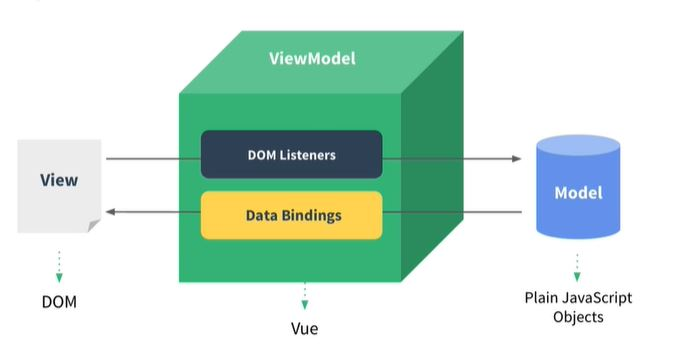

# 뷰 소개 

#### 뷰란 무엇인가

View - 사용자가 보는 html 화면, 사용자에 의해 특정 이벤트가 발생하면 
ViewModel의 DOM Listeners가 청취하다가 이벤트를 받아 자바스크립트에 있는 특정 데이터를 바꿔주거나 자바스크립트 로직을 실행하게 된다. 

Model - 자스의 데이터가 변했을 때 데이터 바인딩을 통해 View에 반영한다.
